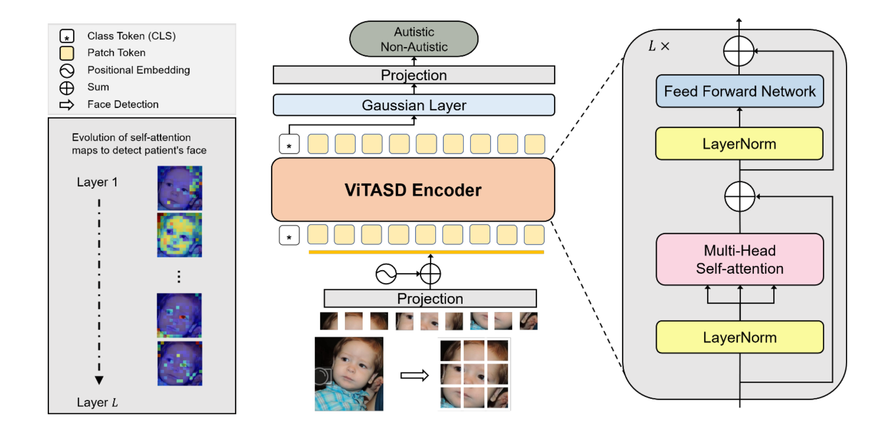
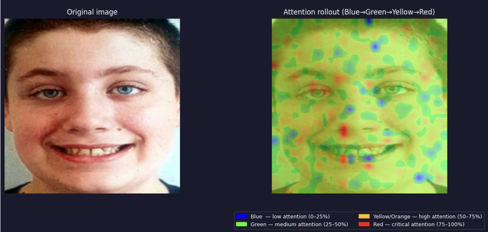
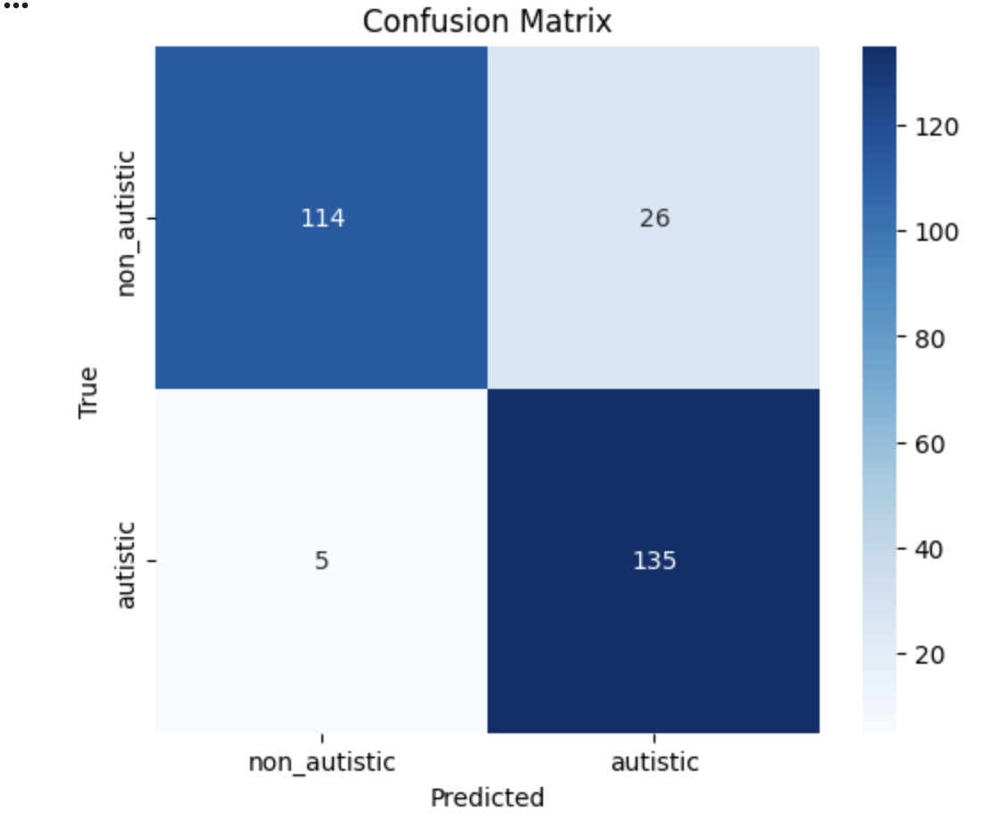
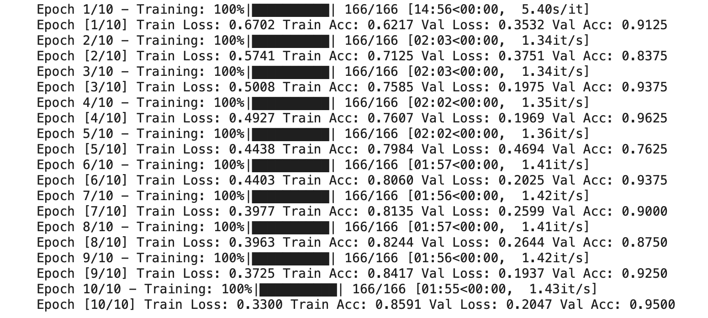

# Vision Transformer Autism Detection

## Overview

This project presents an automated deep learning-based system for detecting Autism Spectrum Disorder (ASD) using facial image analysis and Vision Transformer (ViT) architecture.

The system classifies facial images into:
- ASD (Autism Spectrum Disorder)
- Non-ASD

Unlike traditional Convolutional Neural Networks (CNNs), the Vision Transformer captures global relationships between facial regions using a self-attention mechanism, enabling better understanding of subtle ASD-related facial patterns.

---

## Key Features

- Vision Transformer (ViT) based image classification
- Transfer learning using pretrained ImageNet weights
- RGB Attention Rollout Visualization
- Data augmentation and preprocessing
- Cross-validation evaluation
- Confusion matrix and performance metrics

---

## Technologies Used

- Python
- PyTorch
- TorchVision
- timm
- NumPy
- Matplotlib
- Seaborn
- Scikit-learn

---

## Model Architecture

The project uses:

python vit_base_patch16_224 

The Vision Transformer:
- Splits facial images into patches
- Uses multi-head self-attention
- Learns global facial relationships
- Performs binary classification for ASD detection

---

## Dataset

- Facial image dataset from Kaggle
- ASD and Non-ASD classes
- Images resized to 224×224
- Data augmentation applied

---

## Evaluation Metrics

The project evaluates:
- Accuracy
- Precision
- Recall
- F1 Score
- Confusion Matrix

---

## RGB Attention Rollout Visualization

An RGB Attention Rollout mechanism is integrated to improve interpretability.

The visualization highlights:
- Red → high attention
- Green → medium attention
- Blue → low attention

This helps identify which facial regions contributed most to the model prediction.

---

## Research Contribution

This project was developed as part of a Bachelor of Technology degree in Artificial Intelligence and Data Science at Sri Venkateswara College of Engineering.

The accompanying thesis is available in the thesis/ directory.

---

## Future Improvements

- Grad-CAM integration
- Real-time web deployment
- Larger dataset training
- Hyperparameter optimization
- Medical clinical validation

---

## Author

Srijan S I

## Architecture

---

## Attention Rollout Visualization

---

## Confusion Matrix

---

## Training Logs

